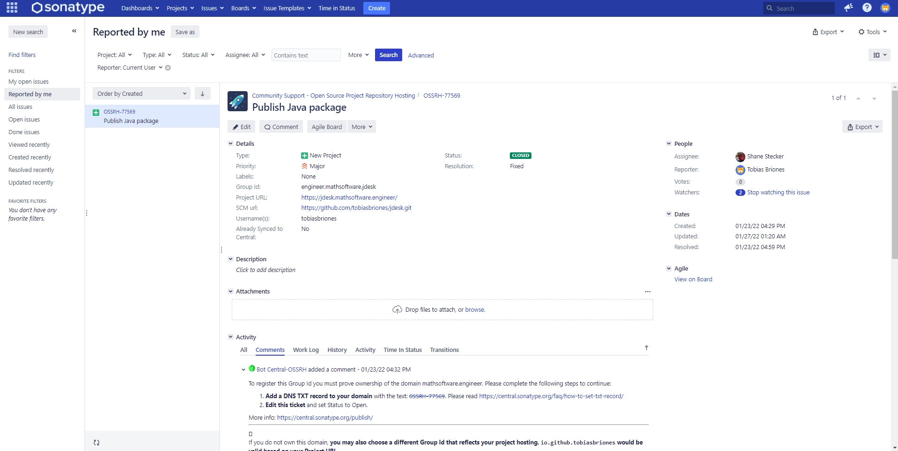
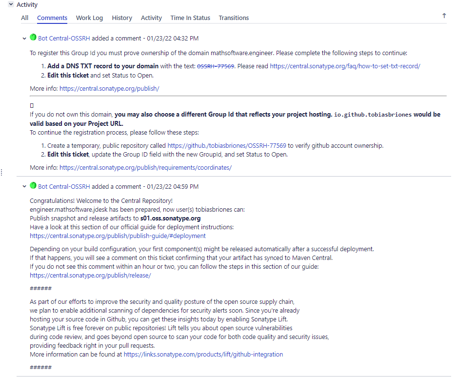
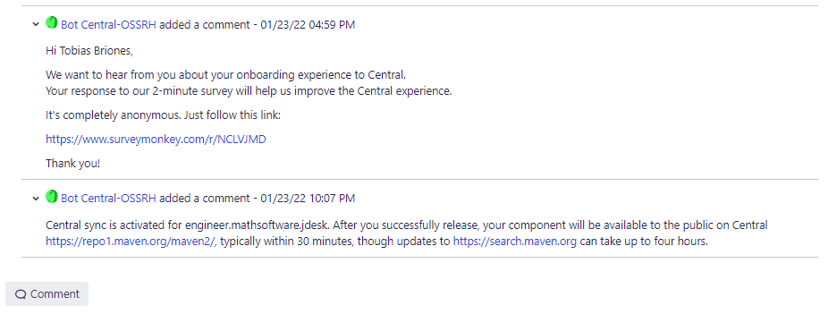
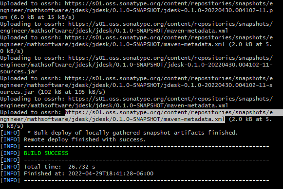
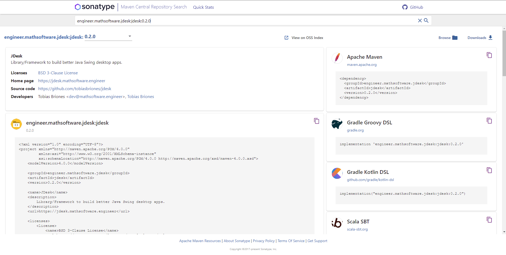

# Publish

This guide will describe how to publish the JDesk framework to Maven Central.

The project is written in Java using Maven as the build tool. So the process
will be detailed for Java projects with a `pom.xml` file.

## Get Ready for Publishing Packages

Publishing a Java artifact is not as trivial as Python or JavaScript packages
can be deployed.

You have to comply with several rules.

I will show the general steps to publish the artifact.

### Basic Requirements

You need to own a domain name where the package is going to live or be hosted.
It is not necessary to have a domain name for each package, you can use the
GitHub.io page that is generated from your project, but for real packages is
required to have a professional domain. In this case, the domain is
jdesk.mathsoftware.engineer.

This is semantic, such that you follow the subsets of: engineers (all engineers)
-> mathsoftware (me, a particular engineer) -> jdesk (a project of mine).

Later, the reverse DNS has to be used for the standard Java packaging
convention. That is, engineer.mathsoftware.jdesk.

### Safety

You will also need a private key to sign the artifact. Generate
a [GPG key](https://www.gnupg.org/download) to use. Then run `gpg --gen-key`
and set it up like when you generate a GitHub GPG key.

### Build Tool

You can use Gradle or Maven as the build tool. Because of the nature of this
project, I chose to use Maven in the beginning. So this article will use Maven
to configure the `pom.xml` file.

You need to have Maven installed into your system. Go
to [download Apache Maven](https://maven.apache.org/download.cgi), uncompress
the file, add the environment variables "M2_HOME", and then add the entry to the
Path env variable with the value of the binaries "%M2_HOME%\bin" (Windows).

### Create a JIRA Account and Request a Ticket

First, you will need to have a
[Sonatype JIRA account](https://issues.sonatype.org/secure/Signup!default.jspa)
to open a new ticket to request your access to publish your artifact.

This sounds really weird, at least for the first time I had to do it. Just keep
carrying on.

Then, create a
[JIRA ticket](https://issues.sonatype.org/secure/CreateIssue.jspa?issuetype=21&pid=10134)
to fill your information. I will add screenshots to get you an idea of how to
proceed. Then you will be assisted by a bot to complete your request.







As shown above, you have to fill your domain name, the git repository. Then
prove ownership by adding a text record to your domain.

### Next Steps

That was the overall process. You can read
[Publish Artifacts to Maven Central \| JetBrains Space](https://www.jetbrains.com/help/space/publish-artifacts-to-maven-central.html)
and [OSSRH Guide - The Central Repository Documentation](https://central.sonatype.org/publish/publish-guide)
for more details.

You will need to upload your PG key, read
[Working with PGP Signatures - The Central Repository Documentation](https://central.sonatype.org/publish/requirements/gpg/#installing-gnupg)
to complete this step. Recall to set a secure passphrase, expiration date, and
store the key, and its backup safely too.

#### Release Version

Two kind of releases are used for Java packages.

The normal versions, like `0.1.0` and SNAPSHOT versions like `0.1.0-SNAPSHOT`.

This is also confusing, but it only means that the SNAPSHOT version that goes to
a basic repository can still have minimum changes by the developer, so the
consumer knows that version might change a little yet. The normal version on the
other hand, is deployed to the main repository, and it takes about 4 hours to
reflect the changes.

#### Save your Environment Variables

You can safely store your credentials into the `.m2/settings.xml` file in your
user's home directory.

In order to connect to your OSSRH, you will give your credentials to the maven
command.

Your file will look like this:

```xml
<settings xmlns="http://maven.apache.org/SETTINGS/1.0.0"
          xmlns:xsi="http://www.w3.org/2001/XMLSchema-instance"
          xsi:schemaLocation="http://maven.apache.org/SETTINGS/1.0.0 https://maven.apache.org/xsd/settings-1.0.0.xsd">
    <servers>
        <server>
            <id>ossrh</id>
            <username>{ username }</username>
            <password>{ password }</password>
        </server>
    </servers>

    <profiles>
        <profile>
            <id>ossrh</id>
            <activation>
                <activeByDefault>true</activeByDefault>
            </activation>
            <properties>
                <gpg.executable>gpg</gpg.executable>
                <gpg.keyname>{ gpg-key }</gpg.keyname>
                <gpg.passphrase>{ gpg-passphrase }</gpg.passphrase>
            </properties>
        </profile>
    </profiles>
</settings>
```

You will add your credentials. I would like to store encrypted passwords
instead, but that would be another step to add tho this guide.

**TIP:** Run `gpg --list-secret-keys --keyid-format=long` to check the GPG keys
installed on your machine. Then you can get your key's id. You will copy the
long HEX number, read the PG guide given above to check more details.

This process can be tricky, so you will likely have to solve some issues in the
way.

## Set Up Maven in the Project

This is the configuration that was applied to the project. It has many things,
so it is exhausting. Once this is done properly, the release without errors will
be trivial.

The following is to be added to the `pom.xml` file of the project, apart from
the standard properties like group id, version, etc.

The general information like name, description, etc., will be shown when the
artifact gets deployed on Maven.

As you can see, the first tags are just general project information:

```xml
<project>
    <!--- ... -->
    <name>JDesk</name>
    <description>
        Library/Framework to build better Java Swing desktop apps.
    </description>
    <url>https://jdesk.mathsoftware.engineer</url>

    <licenses>
        <license>
            <name>BSD 3-Clause License</name>
            <url>https://opensource.org/licenses/BSD-3-Clause</url>
        </license>
    </licenses>

    <developers>
        <developer>
            <name>Tobias Briones</name>
            <email>dev@mathsoftware.engineer</email>
            <organization>Tobias Briones</organization>
            <organizationUrl>https://mathsoftware.engineer</organizationUrl>
        </developer>
    </developers>
</project>
```

Then, other information about the project's repository:

```xml
<project>
    <!--- ... -->
    <scm>
        <connection>
            scm:git:git://github.com/tobiasbriones/jdesk.git
        </connection>
        <developerConnection>
            scm:git:ssh://github.com:tobiasbriones/jdesk.git
        </developerConnection>
        <url>https://github.com/tobiasbriones/jdesk</url>
    </scm>
</project>
```

### Build Config

This will add the configuration for the build tag.

Add the maven plugin for source code:

```xml
<plugin>
    <groupId>org.apache.maven.plugins</groupId>
    <artifactId>maven-source-plugin</artifactId>
    <version>3.2.1</version>
    <executions>
        <execution>
            <id>attach-sources</id>
            <goals>
                <goal>jar-no-fork</goal>
            </goals>
        </execution>
    </executions>
</plugin>
```

and the other for the javadocs, the javadoc binary has to be set to match your
system's javadoc:

```xml
<plugin>
    <groupId>org.apache.maven.plugins</groupId>
    <artifactId>maven-javadoc-plugin</artifactId>
    <version>3.2.0</version>
    <executions>
        <execution>
            <id>attach-javadocs</id>
            <goals>
                <goal>jar</goal>
            </goals>
        </execution>
    </executions>
    <configuration>
        <javadocExecutable>
            ${java.home}/bin/javadoc
        </javadocExecutable>
    </configuration>
</plugin>
```

Then, we need two more plugins:

```xml
<plugin>
    <groupId>org.apache.maven.plugins</groupId>
    <artifactId>maven-surefire-plugin</artifactId>
    <version>2.22.2</version>
</plugin>
```

```xml
<plugin>
    <groupId>org.sonatype.plugins</groupId>
    <artifactId>nexus-staging-maven-plugin</artifactId>
    <version>1.6.8</version>
    <extensions>true</extensions>
    <configuration>
        <serverId>ossrh</serverId>
        <nexusUrl>https://s01.oss.sonatype.org/</nexusUrl>
        <autoReleaseAfterClose>true</autoReleaseAfterClose>
    </configuration>
</plugin>
```

The final build configuration will look like this:

```xml
<build>
    <plugins>
        <plugin>
            <groupId>org.apache.maven.plugins</groupId>
            <artifactId>maven-source-plugin</artifactId>
            <version>3.2.1</version>
            <executions>
                <execution>
                    <id>attach-sources</id>
                    <goals>
                        <goal>jar-no-fork</goal>
                    </goals>
                </execution>
            </executions>
        </plugin>
        <plugin>
            <groupId>org.apache.maven.plugins</groupId>
            <artifactId>maven-javadoc-plugin</artifactId>
            <version>3.2.0</version>
            <executions>
                <execution>
                    <id>attach-javadocs</id>
                    <goals>
                        <goal>jar</goal>
                    </goals>
                </execution>
            </executions>
            <configuration>
                <javadocExecutable>
                    ${java.home}/bin/javadoc
                </javadocExecutable>
            </configuration>
        </plugin>
        <plugin>
            <groupId>org.apache.maven.plugins</groupId>
            <artifactId>maven-surefire-plugin</artifactId>
            <version>2.22.2</version>
        </plugin>
        <plugin>
            <groupId>org.sonatype.plugins</groupId>
            <artifactId>nexus-staging-maven-plugin</artifactId>
            <version>1.6.8</version>
            <extensions>true</extensions>
            <configuration>
                <serverId>ossrh</serverId>
                <nexusUrl>https://s01.oss.sonatype.org/</nexusUrl>
                <autoReleaseAfterClose>true</autoReleaseAfterClose>
            </configuration>
        </plugin>
    </plugins>
</build>
```

### Distribution Management Config

Add this child to the project's root:

```xml
<distributionManagement>
    <snapshotRepository>
        <id>ossrh</id>
        <url>
            https://s01.oss.sonatype.org/content/repositories/snapshots
        </url>
    </snapshotRepository>
    <repository>
        <id>ossrh</id>
        <url>
            https://s01.oss.sonatype.org/service/local/staging/deploy/maven2/
        </url>
    </repository>
</distributionManagement>
```

That way, you set the repositories for snapshots, and final release. If you go
to the snapshot repository link, you will literally find the directory for all
the repositories added with their reverse DNS.

### Profiles Config

We'll want to run a profile called ci-cd with the following configuration:

```xml
<profiles>
    <profile>
        <id>ci-cd</id>
        <build>
            <plugins>
                <plugin>
                    <groupId>org.apache.maven.plugins</groupId>
                    <artifactId>maven-gpg-plugin</artifactId>
                    <version>1.6</version>
                    <executions>
                        <execution>
                            <id>sign-artifacts</id>
                            <phase>verify</phase>
                            <goals>
                                <goal>sign</goal>
                            </goals>
                            <configuration>
                                <keyname>${gpg.keyname}</keyname>
                                <passphraseServerId>
                                    ${gpg.keyname}
                                </passphraseServerId>
                                <gpgArguments>
                                    <arg>--pinentry-mode</arg>
                                    <arg>loopback</arg>
                                </gpgArguments>
                            </configuration>
                        </execution>
                    </executions>
                </plugin>
            </plugins>
        </build>
    </profile>
</profiles>
```

Visit [Introduction to Build Profiles \| Apache Maven](https://maven.apache.org/guides/introduction/introduction-to-profiles.html)
to learn more about Maven profiles.

This configuration is tricky. It's useful for verification of the GPG signature,
and it looks like it'll prevent some issues.

I copied this profile from internet months ago to complete my configuration, it
would be good to elaborate more on this step if required. I have also read that
you have to use the GPG agent GUI to enter your passphrase, and do not enter it
on the terminal, to take into account. As documented above, the GPG passphrase
is stored in the `settings.xml` file, so this should not concern here.

This is the profile to run when deploying the artifact.

### Maven pom.xml File

The final `pom.xml` file ends up [like this](../pom.xml).

## Deploy the Project

In this last step, if everything is all right, we can now deploy the artifact.
Add "-SNAPSHOT" if you will deploy to the snapshot repository. For example:

```xml
<version>0.1.0-SNAPSHOT</version>
```

or else:

```xml
<version>0.1.0</version>
```

Open Git Bash into the project's directory and run the deploy-command with the "
ci-cd" profile:

`mvn clean deploy -Pci-cd`

This will give you an output like this if you deploy a snapshot:



Recall that the production release takes some 4 waiting hours to complete the
deployment and be available at [Maven Search](https://search.maven.org).

## Result

After deploying to the main repository, which took more than 4 hours to get it
done, the result is there:


